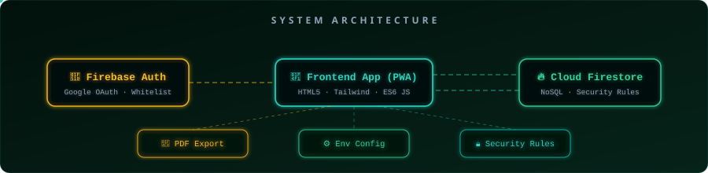
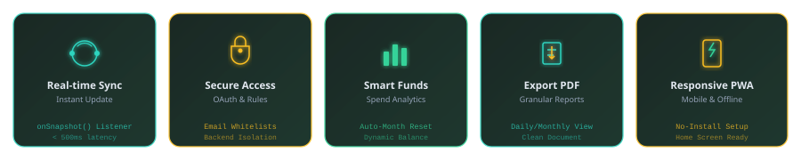

<!-- ═══════════════════════════════════════════════════════════════════ -->
<!-- ✨ ANIMATED HEADER BANNER — 3D wireframe + food visualization     -->
<!-- ═══════════════════════════════════════════════════════════════════ -->

<p align="center">
  
</p>

<!-- Badges Row -->
<p align="center">
  <a href="https://mess-maneger.onrender.com/"></a>
  <a href="https://github.com/JyotirmoyLaha/mess-maneger"></a>
  <a href="https://www.linkedin.com/in/jyotirmoylaha2005/"></a>
  <a href="mailto:jyotirmoylaha@gmail.com"></a>
</p>

<p align="center">
  
  
  
</p>

<!-- ═══════════════════════════════════════════════════════════════════ -->
<p align="center"></p>
<!-- ═══════════════════════════════════════════════════════════════════ -->

##  &nbsp;About

> **Mess Manager** is a production-grade Progressive Web App designed for real-time expense tracking in shared living situations (hostels, mess halls, co-living spaces). It combines a modern, professional UI with robust backend infrastructure, featuring instant Firebase real-time synchronization, secure Google authentication, and offline capabilities.

<br/>

<!-- ═══════════════════════════════════════════════════════════════════ -->
<!-- 🏗️ ANIMATED ARCHITECTURE DIAGRAM                                   -->
<!-- ═══════════════════════════════════════════════════════════════════ -->

##  &nbsp;Architecture

<p align="center">
  
</p>

<details>
<summary>📂 <b>Directory Structure</b></summary>
<br/>

```
mess-maneger/
├── index.html              # Clean SPA layout
├── styles.css              # Custom CSS rules & animations
├── script.js               # Reactive state & Firebase logic
├── firestore.rules         # Cloud Firestore security rules
├── .env                    # Environment credentials
├── .env.example            # Environment template
├── .gitignore              # Ignored local configurations
├── SETUP.md                # Quick local setup guide
├── SECURITY_SETUP.md       # Secure database setup guide
└── README.md               # This README document
```

</details>

<br/>

<!-- ═══════════════════════════════════════════════════════════════════ -->
<p align="center"></p>
<!-- ═══════════════════════════════════════════════════════════════════ -->

##  &nbsp;Core Features

<p align="center">
  
</p>

<br/>

<table>
  <tr>
    <td width="50%">

### 🔄 Real-time Expense Sync

- Instant database synchronization via Firestore `onSnapshot`
- Real-time balances and remaining funds calculated instantly
- Attributions tagged with profile photos from Google OAuth
- Granular Daily/Monthly filters for flexible spending views

</td>
<td width="50%">

### 💸 Smart Fund Management

- Intelligent automatic month reset detects YYYY-MM changes
- Preserves historical records on database transitions
- Displays previous month's final spending dynamically
- Responsive design scales seamlessly from mobile to desktop

</td>
  </tr>
  <tr>
    <td width="50%">

### 📄 Professional PDF Exports

- Generate clean daily and monthly billing reports
- Auto-calculate grand totals and attributions per member
- Ready-to-print or share PDF formats
- Seamless frontend document generation

</td>
<td width="50%">

### ⚡ Premium UI & PWA

- Rich 14-color dynamic shifting background with custom blurs
- Floating physics emoji particles with staggered animations
- Frosted glassmorphism layout with backdrop filters
- Add to Home Screen support with zero-install experience

</td>
  </tr>
</table>

<br/>

<!-- ═══════════════════════════════════════════════════════════════════ -->
<p align="center"></p>
<!-- ═══════════════════════════════════════════════════════════════════ -->

##  &nbsp;Tech Stack

<p align="center">
  
</p>

<br/>

<table>
  <tr>
    <th align="center">Layer</th>
    <th align="center">Technologies</th>
  </tr>
  <tr>
    <td align="center"><b>🎨 Frontend</b></td>
    <td>
      
      
      
      
      
    </td>
  </tr>
  <tr>
    <td align="center"><b>⚙️ Backend &amp; DB</b></td>
    <td>
      
      
      
    </td>
  </tr>
  <tr>
    <td align="center"><b>🔒 Security</b></td>
    <td>
      
      
      
    </td>
  </tr>
</table>

<br/>

<!-- ═══════════════════════════════════════════════════════════════════ -->
<p align="center"></p>
<!-- ═══════════════════════════════════════════════════════════════════ -->

##  &nbsp;Security &amp; Rules

> [!IMPORTANT]  
> Mess Manager implements a robust defense-in-depth security model to ensure that only authorized mess members can view or modify financial data.

### 🛡️ Multi-Layer Protection

#### 1. Frontend Email Whitelist
- Restricts login capability post Google OAuth to configured member emails.
- Instantly logs out unauthorized attempts and displays clear alerts.
- Easily customizable list within `script.js` (`AUTHORIZED_EMAILS` array).

#### 2. Backend Firestore Security Rules
- Restricts data operations database-side, blocking bypasses.
- Enforces user-specific deletion boundaries: members can only delete expenses they personally created.
- Strict field-level checks validate cost ranges, data formats, and user identities.
- Configured and deployed via `firestore.rules`.

```javascript
// Firestore Security Rule Snippet
function isAuthorizedUser() {
  return request.auth != null && (
    request.auth.token.email.lower() == 'member1@gmail.com' ||
    request.auth.token.email.lower() == 'member2@gmail.com'
  );
}
```

📖 **Full Security Setup Guide:** Review [SECURITY_SETUP.md](SECURITY_SETUP.md) for database deployments.

<br/>

<!-- ═══════════════════════════════════════════════════════════════════ -->
<p align="center"></p>
<!-- ═══════════════════════════════════════════════════════════════════ -->

##  &nbsp;Getting Started

<details open>
<summary><b>1️⃣ Clone &amp; Configure Environment</b></summary>
<br/>

```bash
# Clone the repository
git clone https://github.com/JyotirmoyLaha/mess-maneger.git
cd mess-maneger

# Prepare environment credentials
cp .env.example .env
```

Update the values in `.env` with your Firestore app config details.

</details>

<details>
<summary><b>2️⃣ Configure Whitelisted Members</b></summary>
<br/>

Edit `script.js` to whitelist your mess members:
```javascript
const AUTHORIZED_EMAILS = [
    'member1@gmail.com',
    'member2@gmail.com',
    // Add all your mess members here
];
```

</details>

<details>
<summary><b>3️⃣ Run Server Locally</b></summary>
<br/>

```bash
# Run with python static server
python -m http.server 8000
```
Open **`http://localhost:8000`** in your browser.

</details>

<br/>

<!-- ═══════════════════════════════════════════════════════════════════ -->
<p align="center"></p>
<!-- ═══════════════════════════════════════════════════════════════════ -->

##  &nbsp;Roadmap

- [x] **PDF Reports:** Export daily/monthly expense breakdowns
- [ ] **Data Visualizations:** Dynamic graphs and charting metrics
- [ ] **Multi-Currency:** Support localized currency exchanges
- [ ] **Email Summaries:** Auto-notifications for monthly billings
- [ ] **Dark Mode:** High-contrast color adjustments

<br/>

<!-- ═══════════════════════════════════════════════════════════════════ -->
<!-- ANIMATED FOOTER                                                    -->
<!-- ═══════════════════════════════════════════════════════════════════ -->

<p align="center">
  
</p>

<p align="center">
  <a href="https://mess-maneger.onrender.com/">
    
  </a>
</p>

<p align="center">
  <sub>⭐ Star this repository if you found it useful!</sub>
</p>
