# 🎯 Mess Manager - System Flow Visualization

> **Visual guide to understand how the Mess Manager system works**  
> Interactive flowcharts, architecture diagrams, and data flow illustrations

---

## 📋 Table of Contents
1. [System Architecture](#-system-architecture)
2. [User Authentication Flow](#-user-authentication-flow)
3. [Expense Management Workflow](#-expense-management-workflow)
4. [Fund Management Flow](#-fund-management-flow)
5. [Month Transition Process](#-month-transition-process)
6. [Real-time Data Synchronization](#-real-time-data-synchronization)
7. [Security & Authorization](#-security--authorization)
8. [Component Interaction](#-component-interaction)

---

## 🏗️ System Architecture

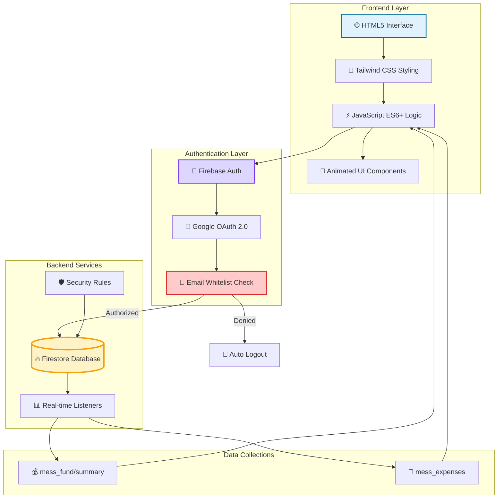

---

## 🔐 User Authentication Flow

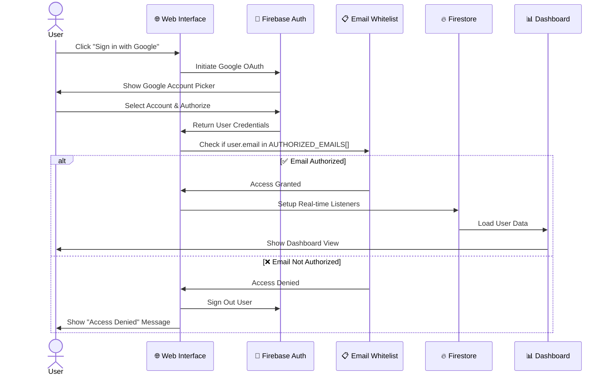

### Authorization Levels

| Level | Access | Email Check | Data Permissions |
|-------|--------|-------------|------------------|
| 🚫 **Unauthorized** | No Access | Not in whitelist | Auto-logout |
| ✅ **Authorized Member** | Full Access | In whitelist | Add, View all; Delete own |
| 👑 **Admin** | Full Control | First email in list | All permissions + whitelist management |

---

## 💳 Expense Management Workflow

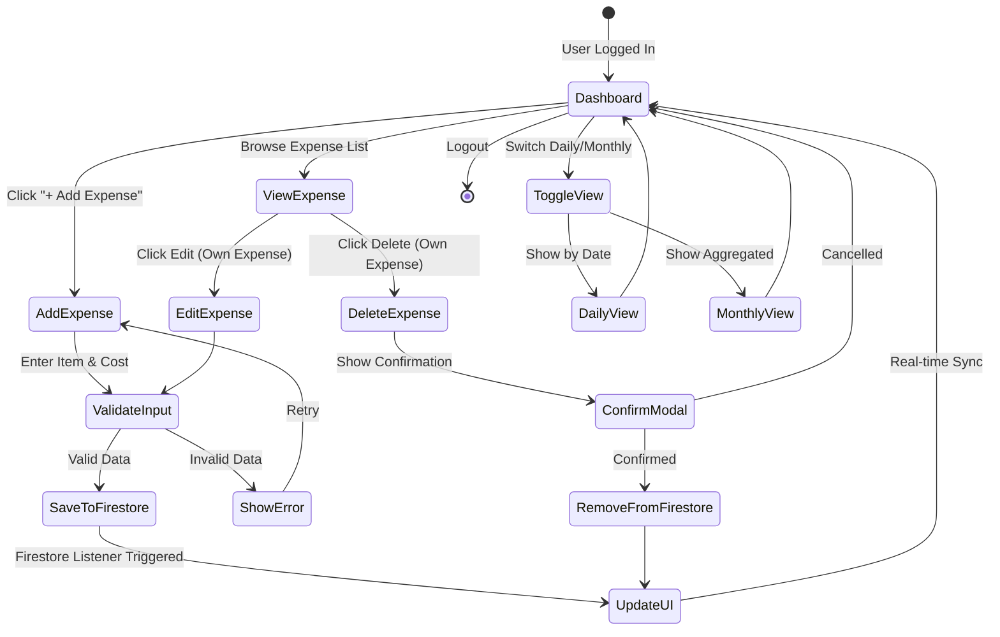

### 📝 Expense Data Structure

```javascript
{
  "id": "auto-generated-doc-id",
  "item": "Vegetables",                    // Expense name
  "cost": 250,                             // Amount in ₹
  "date": "2026-02-07T10:30:00.000Z",     // ISO timestamp
  "addedBy": "Jyotirmoy Laha",            // User display name
  "userPhoto": "https://...",              // Google profile photo URL
  "userId": "firebase-user-uid"            // Unique user identifier
}
```

---

## 💰 Fund Management Flow

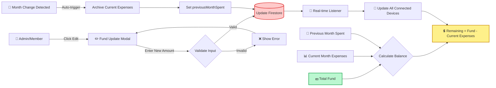

### Fund Calculation Logic

```
✅ Current Balance = Total Fund - Current Month Expenses

📊 Display Components:
├─ 💰 Total Fund: User-editable value
├─ 📉 Current Month Spent: Auto-calculated from expenses
├─ 💵 Remaining: Fund - Current Month Spent
└─ 📅 Previous Month: Stored value from last month
```

---

## 📅 Month Transition Process

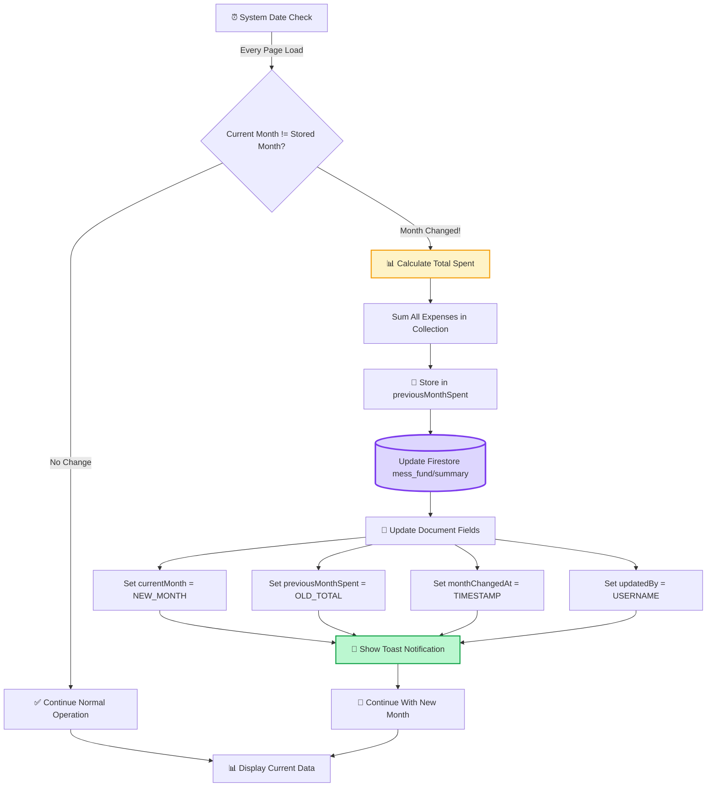

### Month Document Structure

```javascript
// 📄 Firestore: mess_fund/summary
{
  "amount": 5000,                          // Total fund amount
  "currentMonth": "2026-02",               // YYYY-MM format
  "previousMonthSpent": 3240,              // Last month's total expenses
  "monthChangedAt": "2026-02-01T00:00:00Z", // Transition timestamp
  "updatedBy": "Jyotirmoy Laha"           // Who triggered/updated
}
```

---

## 🔄 Real-time Data Synchronization

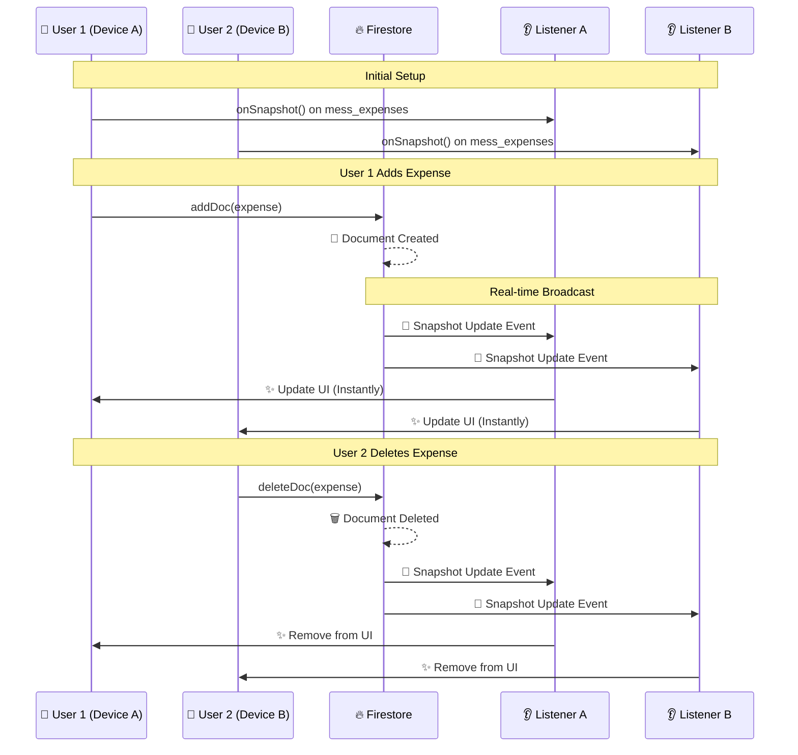

### Listener Implementation

```javascript
// 🎧 Expense Collection Listener
onSnapshot(collection(db, 'artifacts', appId, 'public', 'data', 'mess_expenses'), 
  (snapshot) => {
    // ✅ Real-time updates without manual refresh
    const expenses = snapshot.docs.map(doc => ({id: doc.id, ...doc.data()}));
    updateUI(expenses);
  }
);

// 💰 Fund Document Listener
onSnapshot(doc(db, 'artifacts', appId, 'public', 'data', 'mess_fund', 'summary'),
  (doc) => {
    // ✅ Instant balance updates across all devices
    const fundData = doc.data();
    updateFundDisplay(fundData);
  }
);
```

---

## 🛡️ Security & Authorization

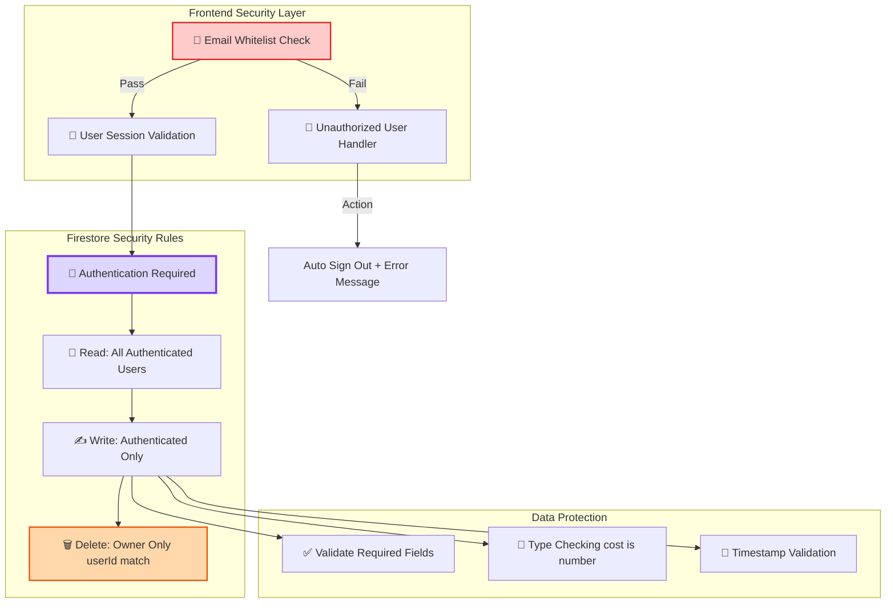

### Security Rules Example

```javascript
// 🔒 firestore.rules
rules_version = '2';
service cloud.firestore {
  match /databases/{database}/documents {
    match /artifacts/{appId}/public/data/mess_expenses/{expenseId} {
      
      // ✅ Everyone authenticated can read
      allow read: if request.auth != null;
      
      // ✏️ Only authenticated users can create
      allow create: if request.auth != null 
                    && request.resource.data.userId == request.auth.uid
                    && request.resource.data.keys().hasAll(['item', 'cost', 'date']);
      
      // 🗑️ Only the creator can delete their expense
      allow delete: if request.auth != null 
                    && resource.data.userId == request.auth.uid;
    }
  }
}
```

---

## 🎨 Component Interaction

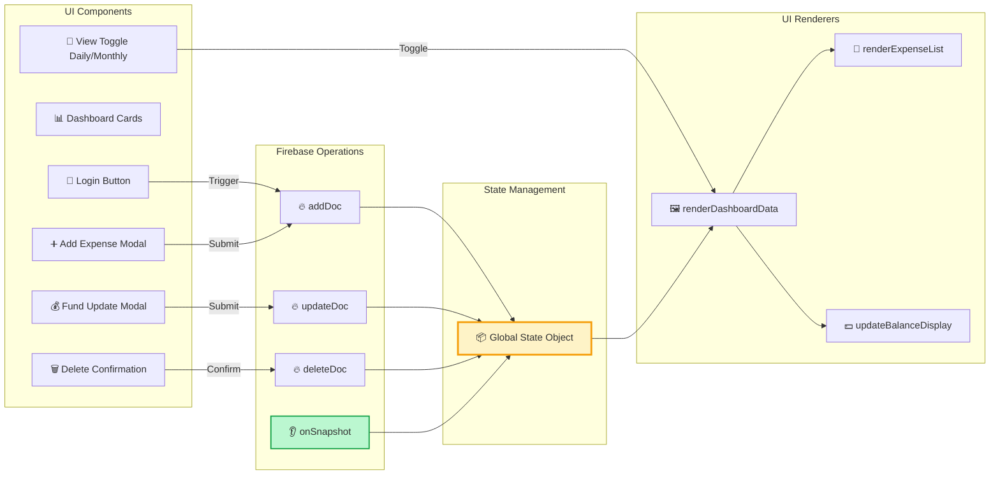

### State Object Structure

```javascript
// 🏪 Global Application State
const state = {
  // 👤 User Information
  user: null,                      // Firebase user object
  username: '',                    // Display name
  userPhoto: '',                   // Profile photo URL
  hasJoined: false,               // Authentication status
  
  // 💰 Financial Data
  totalFund: 0,                   // Total available fund
  expenses: [],                   // Array of expense objects
  previousMonthSpent: 0,          // Last month's total
  
  // 📅 Time Management
  currentMonth: 'YYYY-MM',        // Current month key
  
  // 🎨 UI State
  viewMode: 'daily',              // 'daily' or 'monthly'
  loading: true,                  // Loading indicator
  editId: null,                   // Expense being edited
  deleteTargetId: null,           // Expense to delete
  groupedExpenses: {}             // Expenses grouped by date
};
```

---

## 🔄 Complete User Journey

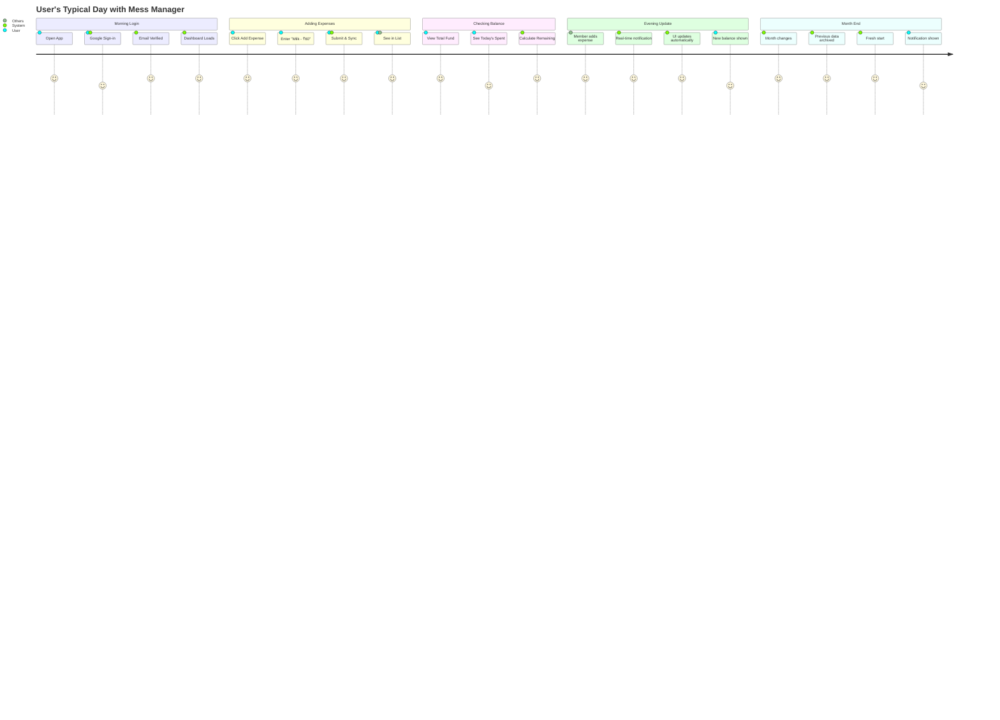

---

## 📊 Data Flow Summary

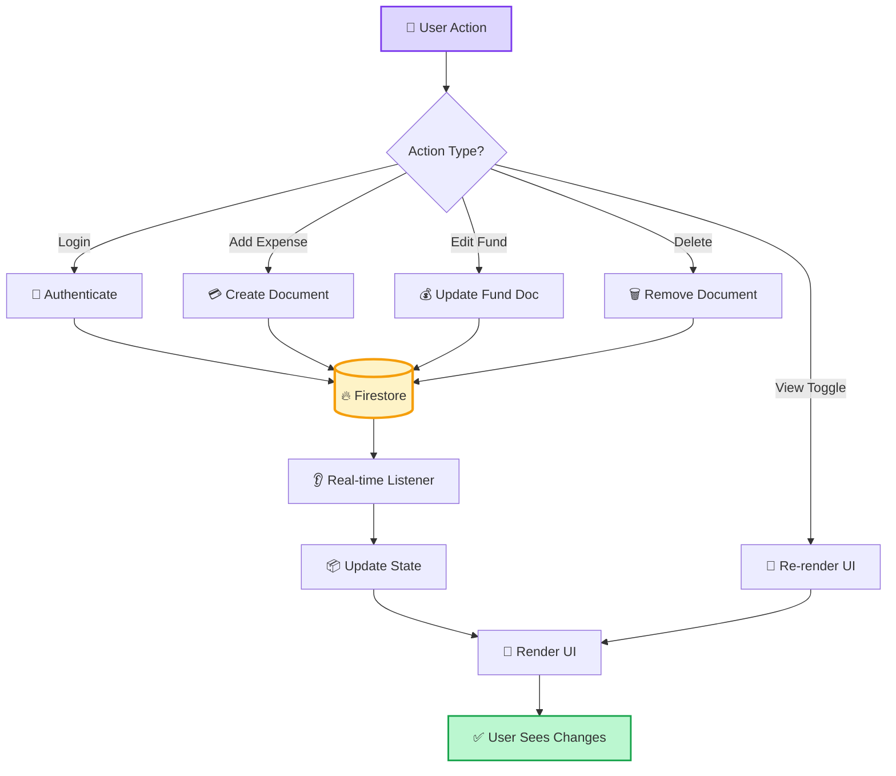

---

## 🎯 Key Technical Highlights

### ⚡ Performance Optimizations
- **Efficient DOM Updates**: Only modified elements are re-rendered
- **Real-time Listeners**: No polling, instant data sync
- **Lazy Loading**: Resources loaded on-demand
- **CSS Animations**: GPU-accelerated transforms

### 🎨 UI/UX Excellence
- **Glass Morphism**: Modern frosted glass cards with 20px backdrop blur
- **Animated Gradient**: 14-color gradient with smooth transitions
- **Floating Particles**: 25 food emojis with variable animation speeds
- **Responsive Design**: Mobile-first with Tailwind CSS
- **Toast Notifications**: Non-intrusive feedback system

### 🔒 Security Layers
1. **Frontend**: Email whitelist check
2. **Authentication**: Google OAuth 2.0
3. **Backend**: Firestore security rules
4. **Data Validation**: Type checking and required fields
5. **User Isolation**: Users can only delete their own expenses

### 🚀 Progressive Web App Features
- **Installable**: Add to home screen on mobile
- **Offline Ready**: Service worker caching
- **Fast Load**: Optimized assets and lazy loading
- **Native Feel**: Full-screen mode and app-like navigation

---

## 📱 Application Views

### 1️⃣ Loading View
```
┌─────────────────────────┐
│                         │
│     🔄 Spinner          │
│   "Loading..."          │
│                         │
└─────────────────────────┘
```

### 2️⃣ Login View
```
┌─────────────────────────┐
│   🍽️ Mess Manager       │
│                         │
│  [🔐 Sign in with      │
│      Google]            │
│                         │
│  "Join your mess"       │
└─────────────────────────┘
```

### 3️⃣ Dashboard View
```
┌─────────────────────────┐
│ 👤 Jyotirmoy   [Logout] │
├─────────────────────────┤
│ 💰 Total: ₹5000    [✏️] │
│ 📊 Spent: ₹1240         │
│ 💵 Left: ₹3760          │
├─────────────────────────┤
│ [Daily] [Monthly] [PDF] │
├─────────────────────────┤
│ 📅 Feb 7, 2026          │
│  🥬 Vegetables - ₹250   │
│     by Soumik       [🗑️]│
│                         │
│  🍚 Rice - ₹500         │
│     by You      [✏️][🗑️]│
├─────────────────────────┤
│     [➕ Add Expense]    │
└─────────────────────────┘
```

---

## 🔮 Future Enhancements

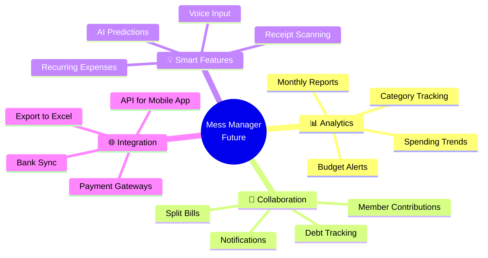

---

## 🎓 Learning Resources

### For Developers
- **Firebase Docs**: [firebase.google.com/docs](https://firebase.google.com/docs)
- **Tailwind CSS**: [tailwindcss.com](https://tailwindcss.com)
- **Mermaid Diagrams**: [mermaid.js.org](https://mermaid.js.org)

### Project Files
- `script.js` - Core application logic
- `index.html` - UI structure
- `styles.css` - Custom animations & styles
- `firestore.rules` - Security rules
- `README.md` - Project documentation

---

<div align="center">

## 🌟 Made with ❤️ for Mess Management

**Built using modern web technologies**

Firebase • JavaScript ES6+ • Tailwind CSS • Real-time Database

---

*Last Updated: February 2026*

</div>
